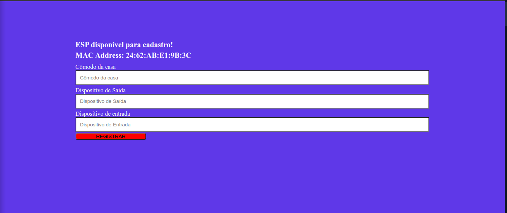
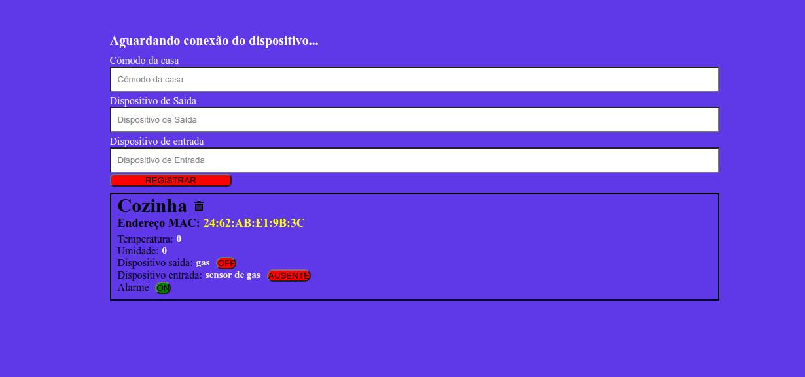

# Projeto Final - Fundamentos de Sistemas Embarcados

## Alunos

| Aluno | Matrícula |
| --- | --- |
| Rômulo Souza | 15/0147601 |
| Sara Silva | 16/0144752 |

## Introdução

O objetivo deste trabalho é criar um sistema distribuído de automação residencial utilizando um computador (PC) como sistema computacional central e placas ESP32 como controladores distribuídos, interconectados via Wifi através do protocolo MQTT. O projeto consite em três módulos:

* cliente: dispositivo ESP32, desenvolvido em C

* central: servidor desenvolvido em python

* frontend: interface desenvolvida em ReactJS


## Dependências

* Sound eXchange ([SoX](https://at.projects.genivi.org/wiki/display/PROJ/Installation+of+SoX+on+different+Platforms)), disponível no APT

* Node v14.16.0+

* Python 3.7+

## Instalação

Execute os passos a seguir para executar todo o projeto


```bash
$ git clone --recursive https://github.com/silvasara/embedded-systems-final-project
```

### Frontend

No diretório do frontend, execute os seguintes comandos

```bash
$ yarn install
$ yarn start
```

### Central

No diretório do servidor central, execute os seguintes comandos

```bash
# Recomenda-se o uso de um ambiente virtual
$ pip install -r requirements.txt

$ python main.py
```

### Cliente

No diretório do cliente, execute os seguintes comandos

```bash
$ . $HOME/esp/esp-idf/export.sh

# Configure as credenciais de rede e selecione a partição como CSV (custom partition table CSV)
$ idf.py menuconfig

$ idf.py build

# Conferir nome do device
$ idf.py -p /dev/ttyUSB0 flash monitor
```


## Testando o Projeto

Com o front e o central iniciados, ao iniciar o cliente, será identificado o MAC address da ESP e enviado para o servidor central.





Recebido o MAC, é possível cadastrar o dispositivo



## Features

* Cadastrar/remover dispositivos

* Pressionar o botão do dispositivo de saída no menu irá alterar o estado do LED

* Pressionar o botão do alarme no menu irá alterar seu estado

* Pressionar o botão boot na esp irá alterar o estado do dispositivo de entrada (caso o alarme esteja ativado, também será tocado um aviso sonoro)

* Pressionar e segurar por 5s o botão boot na esp irá reiniciá-la, reiniciando também as configurações do servidor central e front


